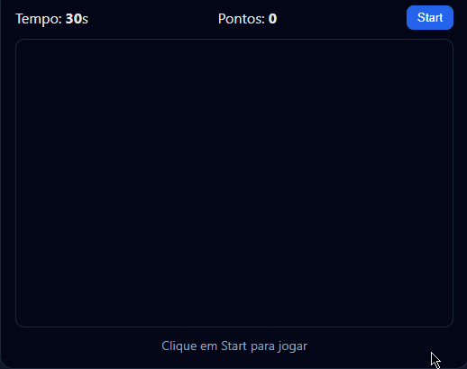

## 👋 Olá, eu sou o Arthur Augusto

Sou **Desenvolvedor Web** com foco em **backend, frontend e construção de soluções digitais completas**.  
Tenho experiência criando aplicações do zero, lidando com lógica, banco de dados, interfaces, organização de código e experiência do usuário.

Gosto de entender o problema como um todo e transformar ideias em produtos funcionais, bem estruturados e escaláveis.

---

## 🚀 O que eu faço
- Estudo muito para continuar evoluíndo😅
- Aprendo rápido para não ficar atrás no mercado😁
- Trabalho duro para ser o melhor profissional possível😎
---

## 🛠️ Tecnologias e conhecimentos

### 👨‍💻 Linguagens

  
  
  
  
  

### 🌐 Frontend

  
  
  
  

### 🧠 Backend

  
  
  

### 🗄️ Banco de Dados

  
  

### ⚙️ Ferramentas e Outras Tecnologias

  
  
  

### 🎨 Design & Criação

  
  

---

## 📚 Atualmente aprendendo
- ⚛️ React
- Boas práticas de arquitetura e organização de projetos
- Aprimoramento contínuo em backend e frontend

---

## 📌 Sobre este GitHub
Este GitHub reúne projetos pessoais, estudos e experimentos, refletindo minha evolução técnica, curiosidade e forma de pensar soluções.

---

## 📫 Onde me encontrar
- 💼 LinkedIn: https://www.linkedin.com/in/arthur-augusto-oliveira-dias-263384316/

---

> “The people who are crazy enough to think they can change the world are the ones who do.”  
> — Steve Jobs

---

## Agora que você me conhece, duvido fazer mais que 30 pontos aqui👇

  

  👉 <strong><a href="https://DevArthurDias.github.io/bug-hunt/" target="_blank">
    Clique aqui para jogar
  </a></strong>

